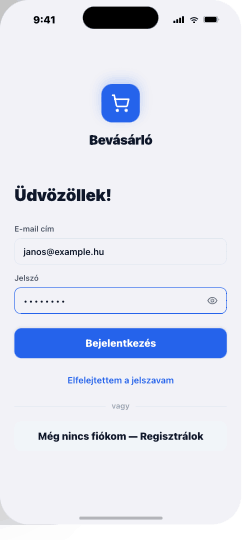

# 01 — Login

> **Auth stack root.** First-touch screen before the app graph.
> **Reference:** `screens.html` §01

## Frame

390 × 844 pt · safe top 59 · safe bottom 34

## Zones (top → bottom)

| Zone | Height |
|---|---|
| Status bar (safe area) | 59 pt |
| Logo + brand | ~120 pt |
| "Üdvözöllek!" heading-lg | 34 pt |
| Email + password fields | ~160 pt |
| Primary CTA "Bejelentkezés" lg | 50 pt |
| Ghost "Elfelejtettem a jelszót" | 44 pt |
| "— vagy —" divider | 32 pt |
| Secondary "Regisztrálok" lg | 50 pt |
| Bottom safe area | 34 pt |

## Interactions

| Trigger | Behavior |
|---|---|
| Email focus | Border animates to `primary` in 120 ms. `keyboardType="email-address"`, `autoCapitalize="none"`. |
| Eye toggle (password) | Swaps `secureTextEntry`; icon `Eye` ↔ `EyeOff`; **light haptic**. |
| Login tap | Button enters `loading` state (spinner + width-locked). On error: red toast + email field shakes 4 px × 3. |
| Forgot password | Push to recovery flow (out of scope for v0.1). |
| Register | Push to sign-up screen. |

## State machine

```
idle
  ↓ (both fields ≥ 1 char)
ready
  ↓ tap login
loading
  ↓ success                ↓ error
authenticated → app    idle + toast + shake
```

## Edge cases

- **Empty fields:** Login button starts disabled (opacity 0.4). Enables once both fields have ≥ 1 char.
- **Invalid email:** Inline error 250 ms after blur (not while typing). Copy: `"Nem érvényes e-mail cím."`
- **Offline:** Login attempt → info toast: `"Nincs kapcsolat. Próbáld újra."`
- **Dark mode:** Automatic. Background `#0F172A`, fields `#1E293B`, divider `#334155`. Logo flips to white.

## Component tree

```
<SafeAreaView className="flex-1 bg-background px-screen-x">
  <View className="items-center mt-12">
    <LogoMark />
    <Text className="heading-md mt-3">Bevásárló</Text>
  </View>

  <Text className="heading-lg mt-8">Üdvözöllek!</Text>

  <View className="gap-4 mt-6">
    <Input label="E-mail cím" type="email" required value={email} onChangeText={setEmail} error={emailError} />
    <Input label="Jelszó" type="password" required value={password} onChangeText={setPassword} />
  </View>

  <Button label="Bejelentkezés" variant="primary" size="lg" fullWidth loading={submitting} disabled={!canSubmit} onPress={handleLogin} className="mt-6" />

  <Button label="Elfelejtettem a jelszót" variant="ghost" size="md" onPress={onForgot} className="mt-2" />

  <Divider label="vagy" className="my-6" />

  <Button label="Regisztrálok" variant="secondary" size="lg" fullWidth onPress={onRegister} />
</SafeAreaView>
```

## Navigation

- **Route name:** `Login`
- **Parent:** `AuthStack`
- **Header:** hidden (`headerShown: false`)
- **Push targets:** `ForgotPassword` (out of scope v0.1), `Register`
- **Replace on success:** `AppTabs`

## Screenshot


