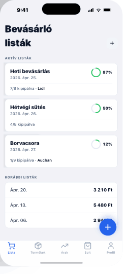

# 02 — ListOverview

> **Tab 1 (Lista) root.** Bevásárló listák gyűjtőképernyője.
> **Reference:** `screens.html` §02

## Frame

390 × 844 pt · safe top 59 · safe bottom 34 (+ 49 pt tab bar)

## Zones

| Zone | Height |
|---|---|
| Status bar | 59 pt |
| Large title nav ("Bevásárló listák" + `+`) | 96 pt |
| "Aktív listák" section header | 44 pt |
| Active list card (each) | 96 pt |
| "Korábbi listák" section header | 44 pt |
| Past list row (each) | 56 pt |
| FAB (right, 24 pt over tab bar) | 56 pt |
| Tab bar + safe area | 83 pt |

## Card anatomy (active lists)

- **Left** — list name (`body-lg` semibold) + date (`body-sm` muted)
- **Right** — 32 pt circular progress ring + percent caption
- **Bottom row** — "X/Y kipipálva · Bolt neve" (`body-sm` muted)
- **Swipe ←** reveals destructive (delete) + share lanes
- **Tap** → push `ListDetail` with shared-element ring transition

## FAB

- 56 pt · primary · `shadow-md` · 24 pt from edges
- **Tap** → action sheet:
  - `Új lista`
  - `Blokk szkennelése` (launches OCRFlow)
- Hides on scroll-down (translateY 80 pt over 200 ms), reappears on scroll-up

## Edge cases

- **Empty:** `EmptyState` (cart icon + "Még nincs listád" + "Hozz létre egyet") fills content zone, FAB still shown.
- **Long names:** truncate to 1 line with ellipsis; full name in detail screen.
- **Offline:** top inline banner: `"Offline — utolsó szinkronizálás 2 perce"`. Cards remain interactive.
- **Many lists (50+):** past lists collapse to a `"Korábbi listák megjelenítése (47)"` disclosure row.

## Component tree

```
<Screen>
  <LargeTitleHeader title="Bevásárló listák" trailing={<IconButton icon={<Plus />} onPress={onNew} />} />

  <SectionList
    sections={[
      { title: 'Aktív listák', data: active, renderItem: renderActiveCard },
      { title: 'Korábbi listák', data: past, renderItem: renderPastRow },
    ]}
    ListEmptyComponent={<EmptyState … />}
  />

  <FAB icon={<Plus />} onPress={onFabPress} />
</Screen>
```

## Data shape

```ts
interface ShoppingList {
  id: string;
  name: string;
  createdAt: string;       // ISO
  archivedAt: string | null;
  storeName: string | null;
  itemCount: number;
  checkedCount: number;
}
```

## Navigation

- **Route:** `ListOverview`
- **Stack:** `ListaStack` (Tab 1)
- **Push targets:** `ListDetail` (with `listId` param)
- **Modal targets:** `OCRFlow` (via FAB action sheet)

## Screenshot


