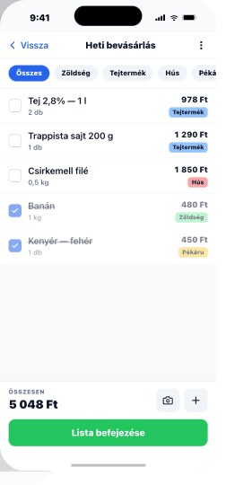

# 03 — ListDetail

> **Edit a single shopping list.** Working surface.
> **Reference:** `screens.html` §03

## Frame

390 × 844 pt

## Zones

| Zone | Height |
|---|---|
| Status bar | 59 pt |
| Stack nav (back / title / ⋮) | 44 pt |
| Filter chip strip · sticky · scrollable | 52 pt |
| List item row (default) | 56 pt |
| Section header (if grouped) | 36 pt |
| Sticky bottom action bar | 112 pt |
| Bottom safe area | 34 pt |

## Filter chips (sticky, horizontally scrollable)

`Összes` · `Zöldség` · `Tejtermék` · `Hús` · `Pékáru` · `Egyéb`

- Active chip: `primary` bg, white text
- Inactive: `secondary` bg, foreground text
- Scrollable horizontally if more than fit

## Row anatomy (56 pt)

- **Left** — 24 pt Checkbox in 44 pt tap target
- **Middle** — name (`body-lg`) + qty/unit (`body-sm` muted)
- **Right** — price (`body-md` semibold) + category Badge
- **Checked** — strikethrough, opacity 0.55, slides to category bottom (180 ms ease-out)
- **Swipe ←** reveals delete; **swipe →** reveals edit

## Bottom bar (112 pt sticky)

Two rows:

1. **Totals row** — "Összesen: 4 320 Ft" + camera icon (OCR) + plus icon (add)
2. **Primary CTA** — "Lista befejezése" (`primary` lg). Locks prices, archives the list, navigates back to overview with success toast.

## Edge cases

- **Long item name:** 2-line wrap allowed. Row grows to 72 pt; price stays right-aligned, top-anchored.
- **All checked:** Bottom CTA pulses once (scale 1 → 1.02 → 1 over 600 ms) to invite completion.
- **Empty filter:** Chip filter with no matches → inline `EmptyState`: `"Nincs ebben a kategóriában. Próbálj másikat."`
- **Offline:** Edits queued locally; subtle `"⤴ várakozó szinkron"` pip on the title.

## Component tree

```
<Screen>
  <StackHeader title={list.name} trailing={<IconButton icon={<MoreVertical />} onPress={openMenu} />} />

  <ChipFilter
    sticky
    chips={CATEGORIES}
    value={filter}
    onChange={setFilter}
  />

  <FlatList
    data={items}
    renderItem={({ item }) => (
      <ListItemRow
        item={item}
        onToggle={() => toggle(item.id)}
        onSwipeLeft={() => confirmDelete(item.id)}
        onSwipeRight={() => editItem(item.id)}
      />
    )}
  />

  <StickyBar>
    <TotalsRow total={total} onScan={openOCR} onAdd={openAddSheet} />
    <Button label="Lista befejezése" variant="primary" size="lg" fullWidth onPress={finish} />
  </StickyBar>

  <ItemAddSheet open={addOpen} onClose={() => setAddOpen(false)} listId={list.id} />
  <ItemEditSheet open={editOpen} item={editingItem} onClose={() => setEditOpen(false)} />
</Screen>
```

## State management

- Item check toggle is **optimistic** — flip locally, persist async, revert on error with toast.
- The "slide to category bottom" sort happens in the render layer (`useMemo` on sorted items), not in storage.

## Navigation

- **Route:** `ListDetail`, params `{ listId: string }`
- **Push targets:** `ItemEdit` (sheet), `ItemAdd` (sheet)
- **Modal targets:** `OCRFlow` (via camera icon — pre-binds to current list)

## Screenshot


