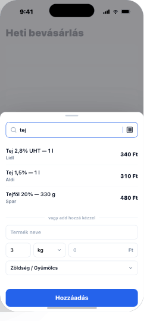

# 04 — ItemAddModal (BottomSheet · half)

> **Half-sheet within ListDetail.** Search-first, manual fallback.
> **Reference:** `screens.html` §04

## Layout

Renders as a `BottomSheet size="half"` over `ListDetail`. The list behind dims to 40 % opacity via the standard backdrop.

| Zone | Height |
|---|---|
| Drag indicator | 20 pt |
| Search field (autofocus + barcode icon) | 52 pt |
| Search results (tap-to-add rows) | 48 pt × n |
| "— vagy add hozzá kézzel —" divider | 36 pt |
| Manual form (name, qty/unit, price, category) | ~200 pt |
| Sticky "Hozzáadás" CTA | 66 pt |

Total sheet ≈ 440 pt (half height on 14/15).

## Behavior

| Action | Result |
|---|---|
| Sheet opens | Search field auto-focused, keyboard up |
| Type in search | 350 ms debounce → query products by name |
| Tap result | Adds item with last-known qty + price · sheet closes · toast `"Hozzáadva ✓"` |
| Long-press result | Opens manual form pre-filled for tweaks |
| Tap barcode icon | Pushes `BarcodeScanModal` (camera scanner full-screen). On hit, jumps to manual form pre-filled. |
| Tap "Hozzáadás" CTA | Adds item using manual form values; sheet closes |
| Drag sheet down | Dismiss when velocity > 800 px/s OR drag > 30 % |

## Edge cases

- **No results:** result list disappears. Manual form moves up; CTA label changes to `"Új termékként hozzáadás"`.
- **Long product name:** result row name truncates to 1 line; store + price stay right-aligned.
- **Camera denied:** barcode tap → warning toast `"Engedélyezd a kamera-hozzáférést a Beállításokban."`
- **Slow search:** if > 350 ms, show 3 `SkeletonRow` in the result list area.

## Component tree

```
<BottomSheet open={open} onClose={onClose} size="half" cta={{ label: ctaLabel, onPress: handleAdd, disabled: !canAdd }}>
  <Input
    type="search"
    placeholder="Termék keresése"
    autoFocus
    value={query}
    onChangeText={setQuery}
    rightAccessory={<IconButton icon={<Barcode />} onPress={openScanner} />}
  />

  {results.length > 0 ? (
    <FlatList
      data={results}
      renderItem={({ item }) => (
        <ResultRow product={item} onTap={() => addQuick(item)} onLongPress={() => prefillManual(item)} />
      )}
    />
  ) : query.length > 0 ? (
    <Divider label="vagy add hozzá kézzel" />
  ) : null}

  <ManualForm value={form} onChange={setForm} hidden={results.length > 0} />
</BottomSheet>
```

## Navigation

- This is **not** a navigation route — it's a sheet inside `ListDetail`.
- The barcode scanner is a child modal: route name `BarcodeScan`, presented over the sheet.

## Screenshot


