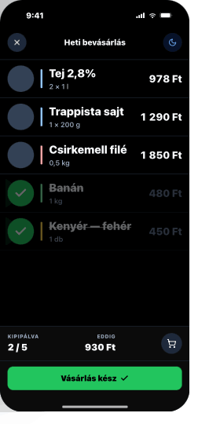

# 05 — ShopMode (Bolt mód) ★

> **The hero screen.** In-aisle, one-handed, oversized targets, pure black.
> **Reference:** `screens.html` §05
> **This screen breaks the theme system on purpose. Read this whole file before touching it.**

## Frame

390 × 844 pt · safe top 59 · safe bottom 34

## Zones

| Zone | Height | Notes |
|---|---|---|
| Status bar (light icons on black) | 59 pt | `barStyle="light-content"` |
| Minimal header (X · title · 🌙) | 52 pt | |
| List row · 72 pt · no separators between categories | 72 pt × n | |
| Sticky progress bar (5/8 + total + cart) | 80 pt | |
| "Vásárlás kész ✓" success CTA | 62 pt | Appears when all checked |
| Bottom safe area | 34 pt | |

## Non-negotiables

- **Background:** `#000000` — true black, **not** `--bg-dark`. Fights store fluorescents.
- **Row text:** 24 pt Semibold (`bolt-mod-item`). Price 22 pt Semibold tabular.
- **Checkbox:** 56 pt filled circle.
  - Empty fill `#334155`, no border, no icon
  - Checked fill `#22C55E`, white check icon (Lucide stroke 3, size 32)
  - Animation: 220 ms spring damping 12, scale 0.8 → 1.3 → 1.0 (intentional overshoot)
  - **Haptic `impactMedium` every tick. No exception.**
- **Checked row:** opacity 0.4, strikethrough — **stays in place**. Positional memory > tidiness.
- **Moon icon:** toggles `expo-keep-awake`. Active state = `primary` blue tint.
- **Theme override:** This screen ignores system dark/light. Always black. Always.

## Sticky bar

- Background `#111827` (`--bolt-bar`)
- Top hairline `#1F2937` (`--bolt-bar-border`)
- Left: "5 / 8 kipipálva"
- Right: "Eddig: 1 840 Ft" + cart glyph
- "Vásárlás kész ✓" CTA appears when all checked **OR** via long-press on the bar (escape hatch). Success green (`#22C55E`), full-width, 50 pt + 12 pt margin.

## Edge cases

- **Long product name:** wraps to 2 lines max; row grows to 92 pt; price stays right-aligned, top-anchored.
- **Offline:** always works — Bolt mód is offline-first. No badge shown to avoid distraction.
- **Single item:** list shows only that row; sticky bar still present. Empty list → push out of Bolt mode with toast.
- **Light mode override:** **Bolt mode ignores system theme. Always black. Always.**

## Component tree

```tsx
import { useKeepAwake } from 'expo-keep-awake';

function ShopMode() {
  useKeepAwake(); // active for entire screen lifetime

  return (
    <View className="flex-1 bg-bolt-bg">
      <StatusBar barStyle="light-content" />

      <BoltHeader
        onClose={() => navigation.goBack()}
        keepAwake={keepAwakeOn}
        onToggleKeepAwake={toggleKeepAwake}
      />

      <FlatList
        data={items}
        renderItem={({ item }) => <BoltRow item={item} onToggle={toggle} />}
        contentContainerStyle={{ paddingBottom: 200 }}
      />

      <StickyBar checkedCount={checked} totalCount={total} totalFt={totalFt} />

      {allChecked && (
        <Button
          label="Vásárlás kész ✓"
          variant="primary"
          size="lg"
          fullWidth
          className="bg-success mx-3 mb-3"
          onPress={complete}
        />
      )}
    </View>
  );
}
```

## BoltRow spec

```tsx
function BoltRow({ item, onToggle }) {
  return (
    <Pressable
      onPress={() => onToggle(item.id)}
      className="flex-row items-center px-4 gap-4"
      style={{ height: item.name.length > 24 ? 92 : 72, opacity: item.done ? 0.4 : 1 }}
    >
      <Checkbox variant="bolt" checked={item.done} onChange={() => onToggle(item.id)} />
      <Text className={`flex-1 text-bolt-mod-item text-white ${item.done ? 'line-through' : ''}`}>
        {item.name}
      </Text>
      <Text className="text-[22px] font-semibold text-white tabular-nums">
        {formatHuf(item.price)}
      </Text>
    </Pressable>
  );
}
```

## Navigation

- **Route:** `ShopMode`, no params (uses currently active list)
- **Stack:** `BoltStack` (Tab 4) — single screen, no children
- **Header:** hidden — custom black header used

## Screenshot


