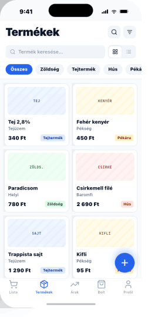

# 06 — ProductList

> **Tab 2 (Termékek) root.** Catalogue front door.
> **Reference:** `screens-04.html` §01

## Frame

390 × 844 pt

## Zones

| Zone | Height |
|---|---|
| Status bar | 59 pt |
| Large title nav (search + filter icons) | 52 pt |
| Search field + view toggle · sticky | 54 pt |
| Category chip strip · sticky · scrollable | 52 pt |
| Grid cell (2 col) — image 80 pt + meta | ~178 pt |
| List row variant (toggle) | 56 pt |
| FAB (right, 24 pt over tab bar) | 56 pt |
| Tab bar + safe area | 83 pt |

## Two view modes

User toggles between **Grid** (default) and **List** via icon-pair on the right of the search field. Persisted in `AsyncStorage` under `product.viewMode`.

### Grid cell (~178 pt)

- **Top** — 80 pt placeholder tile, monospace category code, subtle striped pattern in category tint
- **Body** — name (`body-md` semibold) + brand (`body-sm` muted)
- **Footer** — price (`body-md` bold tabular) left · category Badge right
- **Tap** → `ProductDetail` (fade + 80 pt tile shared-element transition)
- **Long-press** → action sheet "Hozzáadás listához" with active-list rows

### List row variant (56 pt)

- **Left** — 40 × 40 pt tile
- **Middle** — name + brand
- **Right** — price stacked over category Badge
- **Swipe ←** reveals delete (red); **swipe →** reveals edit (blue)

## Category chip strip

`Összes` · `Zöldség` · `Tejtermék` · `Hús` · `Pékáru` · `Egyéb` (horizontal scroll)

## FAB

- 56 pt · primary · `shadow-md`
- **Tap** → push `ProductAdd`
- **Long-press** → action sheet: `Új termék · Barcode beolvasás`

## States

- **Loading:** 6 skeleton tiles (gray pulse, 78 pt image + 2 lines + footer). 600 ms shimmer.
- **Empty:** Box icon · "Nincs termék" · primary button "Első termék hozzáadása" — same target as FAB.
- **Error:** inline card: "Nem sikerült betölteni" · ghost retry. Cached items remain visible.

## Component tree

```
<Screen>
  <LargeTitleHeader title="Termékek" trailing={[<IconButton icon={<Search />} />, <IconButton icon={<SlidersHorizontal />} />]} />

  <StickyHeader>
    <View className="flex-row gap-2 items-center">
      <Input type="search" className="flex-1" />
      <ViewToggle value={viewMode} onChange={setViewMode} />
    </View>
    <ChipFilter chips={CATEGORIES} value={filter} onChange={setFilter} />
  </StickyHeader>

  {viewMode === 'grid' ? (
    <FlatList numColumns={2} data={products} renderItem={renderGridCell} />
  ) : (
    <FlatList data={products} renderItem={renderListRow} />
  )}

  <FAB icon={<Plus />} onPress={openAdd} />
</Screen>
```

## Navigation

- **Route:** `ProductList`
- **Stack:** `TermekekStack` (Tab 2)
- **Push targets:** `ProductDetail` (with `productId`), `ProductAdd`

## Screenshot


