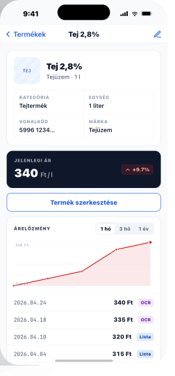

# 07 — ProductDetail

> **Identity card · highlight price · price-history chart.**
> **Reference:** `screens-04.html` §02

## Frame

390 × 844 pt

## Zones

| Zone | Height |
|---|---|
| Status bar | 59 pt |
| Stack nav (back · title · edit) | 44 pt |
| Identity card (tile + name + 2×2 grid) | ~180 pt |
| Highlight price card (dark, with trend chip) | 76 pt |
| "Termék szerkesztése" secondary CTA | 44 pt |
| History header (title + period pill) | 44 pt |
| Area chart | 120 pt |
| History row (date · price · source badge) | 40 pt × n |

## Three stacked cards

### 1. Identity (~180 pt)
80 pt tile + name + brand + 2×2 attribute grid (kategória / egység / barcode / SKU).

### 2. Highlight price (76 pt, dark)
Background `#0F172A`, white text. Large "Jelenlegi ár: 340 Ft" + trend chip (green/red Badge with %).

### 3. History block
Period segmented (`7n` · `30n` · `90n`) + inline area chart + price-log table.

## Chart spec

| Attr | Value |
|---|---|
| x-axis | Time, evenly-spaced samples (no scale gaps); labels on first / last only |
| y-axis | Auto-scaled `[min, max]` with 8 pt padding; min & max printed top-left / bottom-left in mono |
| Line | 2 px, round joins; 4 pt dot on latest sample, 2.5 pt on the rest |
| Fill | 10 % opacity area under the line in trend color |
| Trend | Green `#16A34A` if last < first · Red `#DC2626` if last > first |
| Tooltip | Tap on a dot → caption: `2026.04.18 · 335 Ft · OCR` |

## Source badges (history rows)

| Badge | Use |
|---|---|
| `OCR`    | Auto-extracted from receipt |
| `Lista`  | Captured during a list session |
| `Kézi`   | Typed by user |
| `Import` | CSV / partner feed |

(See `components/Badge.md` for colors.)

## Edge cases

- **Loading:** identity card pulses; chart skeleton (flat gray bar with shimmer 320 × 80 pt).
- **Single price:** chart hidden; replaced with `"Még csak egy ár — vásárolj újra a trendért."`
- **Edit conflict:** if product was edited elsewhere, red banner `"Frissítsd a nézetet"` · pull-to-refresh.

## Interactions

- **Edit tap (pencil icon)** → full bottom sheet (90% height) reusing the Add form pre-filled.
- **Trend chip tap** → anchors/scrolls the page to the chart for context.

## Component tree

```
<Screen>
  <StackHeader title={product.name} trailing={<IconButton icon={<Pencil />} onPress={openEdit} />} />

  <ScrollView contentContainerStyle={{ padding: 16, gap: 12 }}>
    <IdentityCard product={product} />

    <HighlightPriceCard
      price={product.currentPrice}
      trend={product.trend}
      onTrendTap={scrollToChart}
    />

    <Button label="Termék szerkesztése" variant="secondary" size="md" fullWidth onPress={openEdit} />

    <HistoryBlock
      ref={chartRef}
      period={period}
      onPeriodChange={setPeriod}
      samples={history}
    />
  </ScrollView>

  <BottomSheet open={editOpen} size="full" title="Termék szerkesztése" cta={{ label: 'Mentés', onPress: save }}>
    <ProductForm value={form} onChange={setForm} />
  </BottomSheet>
</Screen>
```

## Data shape

```ts
interface Product {
  id: string;
  name: string;
  brand: string | null;
  category: Category;
  unit: string;          // e.g. '1 l', '500 g'
  barcode: string | null;
  sku: string | null;
  imageUrl: string | null;
  currentPrice: number;
  trend: { pct: number; direction: 'up' | 'down' | 'neutral' };
  history: PriceSample[];
}

interface PriceSample {
  date: string;          // ISO
  price: number;
  source: 'ocr' | 'list' | 'manual' | 'import';
  storeName: string | null;
}
```

## Navigation

- **Route:** `ProductDetail`, params `{ productId: string }`
- **Push targets:** none (edit is a sheet, not a route)

## Screenshot


