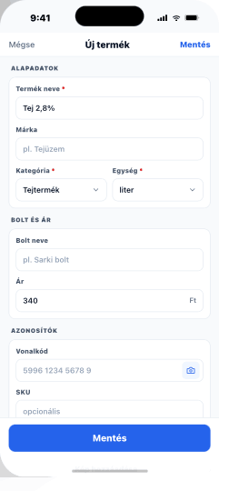

# 08 — ProductAdd

> **Full-screen form** · distinct from the half-sheet ItemAdd.
> **Reference:** `screens-04.html` §03

## Frame

390 × 844 pt

## Zones

| Zone | Height |
|---|---|
| Status bar | 59 pt |
| Stack nav (Mégse · title · Mentés) | 44 pt |
| Alapadatok card (name, brand, cat, unit) | ~250 pt |
| Bolt és ár card | ~150 pt |
| Azonosítók card (barcode + SKU) | ~150 pt |
| Kép card (96 pt thumbnail) | ~140 pt |
| Sticky save · primary lg | 96 pt |

## Four grouped cards

### 1. Alapadatok
- `Termék neve` (required, ≥ 2 chars)
- `Márka` (optional)
- `Kategória` (required, picker)
- `Egység` (required, picker — `1 l`, `500 g`, `1 db`, ...)

### 2. Bolt és ár
- `Bolt` (picker, defaults to most-used last 30 days)
- `Ár` (currency, ≥ 0)

### 3. Azonosítók
- `Vonalkód` — 8 / 12 / 13 digits accepted; camera icon launches scanner
- `SKU` — free-form

### 4. Kép (optional)
- 96 pt thumbnail · `Fotó` / `Galéria` pill row

## Field rules

| Rule | Behavior |
|---|---|
| Required | Red `*` in label. Validation 250 ms after blur. |
| Inline error | Below field, body-sm red. |
| Save state | Disabled (40 % opacity) until required fields filled. Loading spinner once tapped, width-locked. |

## Barcode scanner

- Tap camera tile → full-screen scanner sheet (modal)
- On hit → autofill barcode + lookup attempt:
  - If known: prefill all known fields, toast `"Találat: Tej 2,8%"`
  - If unknown: only barcode filled, focus jumps to "Termék neve"
- Permission denied → warning toast `"Engedélyezd a kamera-hozzáférést a Beállításokban."`

## Save action

Lives in **two places** by design:
1. Nav-bar trailing text button ("Mentés")
2. Sticky bottom CTA — primary lg

Both reflect the same `loading` / `disabled` state.

## Edge cases

- **Saving:** both Save buttons spinner + locked width. Form fields disabled (60 % opacity).
- **Default:** empty form. Image card shows dashed thumbnail + Fotó / Galéria pill row.
- **Duplicate:** if name + brand match an existing product: warning row at top `"Már létezik — szerkeszteni szeretnéd?"` · link to that product.

## Component tree

```
<Screen>
  <StackHeader
    title="Új termék"
    leading={<TextButton label="Mégse" onPress={onCancel} />}
    trailing={<TextButton label="Mentés" onPress={save} disabled={!canSave} loading={saving} />}
  />

  <ScrollView contentContainerStyle={{ padding: 16, gap: 16 }}>
    <Card>
      <CardHeader title="Alapadatok" />
      <Input label="Termék neve" required value={form.name} onChangeText={setName} />
      <Input label="Márka" value={form.brand} onChangeText={setBrand} />
      <PickerField label="Kategória" required value={form.category} onPress={openCatPicker} />
      <PickerField label="Egység" required value={form.unit} onPress={openUnitPicker} />
    </Card>

    <Card>
      <CardHeader title="Bolt és ár" />
      <PickerField label="Bolt" value={form.store} onPress={openStorePicker} />
      <Input label="Ár" type="currency" value={form.price} onChangeText={setPrice} />
    </Card>

    <Card>
      <CardHeader title="Azonosítók" />
      <Input
        label="Vonalkód"
        type="number"
        value={form.barcode}
        rightAccessory={<IconButton icon={<Camera />} onPress={openScanner} />}
      />
      <Input label="SKU" value={form.sku} onChangeText={setSku} />
    </Card>

    <Card>
      <CardHeader title="Kép" />
      <ImagePicker value={form.image} onChange={setImage} />
    </Card>
  </ScrollView>

  <StickyBar>
    <Button label="Mentés" variant="primary" size="lg" fullWidth disabled={!canSave} loading={saving} onPress={save} />
  </StickyBar>
</Screen>
```

## Navigation

- **Route:** `ProductAdd`, no params (or `{ prefill?: Partial<Product> }` for barcode-prefilled flow)
- **Stack:** `TermekekStack`
- **Push targets:** `BarcodeScan` (modal)

## Screenshot


