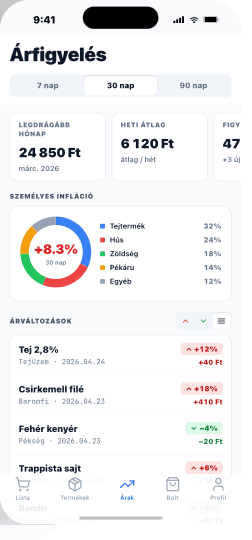

# 09 — PriceOverview

> **Tab 3 (Árak) root.** Dashboard: personal inflation + price-change feed.
> **Reference:** `screens-04.html` §04

## Frame

390 × 844 pt

## Zones

| Zone | Height |
|---|---|
| Status bar | 59 pt |
| Large title + segmented period | 100 pt |
| KPI scroll cards (160 pt wide each) | 96 pt |
| Személyes infláció card (donut + legend) | ~180 pt |
| Árváltozások header + filter pills | 36 pt |
| Change row (name · store · pct · diff) | 56 pt × n |
| Tab bar + safe area | 83 pt |

## Period segmented

Under the large title: `7n` · `30n` · `90n`. Drives every number on the page. Persisted in `AsyncStorage` under `price.period`.

## KPI scroll (horizontal)

3 cards, 160 pt wide each:

1. **Összes költés** — `24 850 Ft`
2. **Átlag / hét** — `6 120 Ft`
3. **Termékek figyelve** — `47`

Each card: `body-sm` muted label on top, `heading-md` value, optional trend chip.

## Személyes infláció card (~180 pt)

- 120 pt donut · stroke 14 pt · 8 pt inner padding
- Track `#F1F5F9` base ring
- Segments per category (Tejtermék blue, Hús red, Zöldség green, Pékáru amber, Egyéb slate)
- Center: headline pct (`heading-xl` tabular) over "30 nap" caption
- Color: red `#DC2626` if positive · green `#16A34A` if negative
- **Tap a segment** → highlight + push to filtered Árváltozások for that category

## Change row (56 pt)

- **Left** — product name (`body-md` semibold) + store · date in mono caption
- **Right** — pct chip (red/green tinted, tabular) + Ft difference beneath
- **Tap** → push `PriceHistoryDetail` for that product (= the chart from screen 07 fullscreen)

## Filter pills

`↑ csak emelkedők` · `↓ csak csökkenők` · `mindkettő` (tri-state segmented). "Mindkettő" default.

## States

- **Loading:** KPI cards 3 × skeleton, donut shows base ring only, change list 5 skeleton rows.
- **No data:** donut card replaced with line-chart icon + `"Adj meg legalább 2 árat ugyanarra a termékre, hogy lássuk a trendet."`
- **Stale:** pull-to-refresh shows `"Frissítve: 2 perce"` pip under the title.

## Component tree

```
<Screen>
  <LargeTitleHeader title="Árfigyelés" />

  <Segmented value={period} onChange={setPeriod} options={['7n', '30n', '90n']} />

  <ScrollView horizontal contentContainerStyle={{ gap: 12, paddingHorizontal: 16 }}>
    <KpiCard label="Összes költés" value={formatHuf(stats.total)} />
    <KpiCard label="Átlag / hét" value={formatHuf(stats.avgPerWeek)} />
    <KpiCard label="Termékek figyelve" value={stats.trackedCount} />
  </ScrollView>

  <PersonalInflationCard
    percent={stats.inflationPct}
    period={`${period} nap`}
    segments={stats.byCategory}
    onSegmentTap={(cat) => filterByCategory(cat)}
  />

  <Section title="Árváltozások">
    <FilterPills value={direction} onChange={setDirection} />
    <FlatList
      data={changes}
      renderItem={({ item }) => (
        <ChangeRow item={item} onTap={() => navigation.push('PriceHistoryDetail', { productId: item.productId })} />
      )}
    />
  </Section>
</Screen>
```

## Navigation

- **Route:** `PriceOverview`
- **Stack:** `ArakStack` (Tab 3)
- **Push targets:** `PriceHistoryDetail` (with `productId`)

## Screenshot


