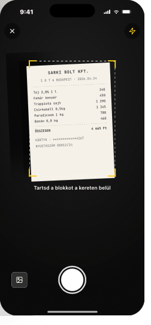
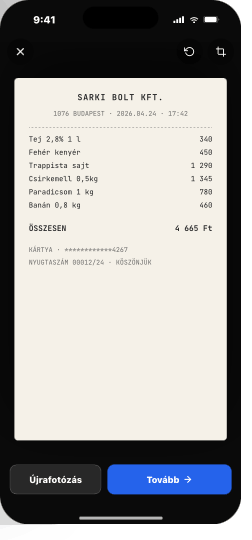
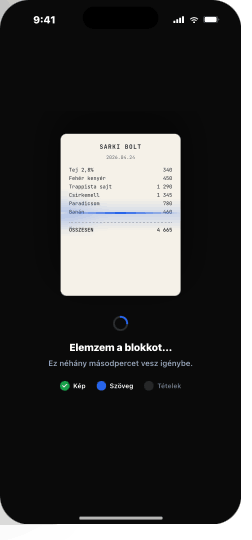
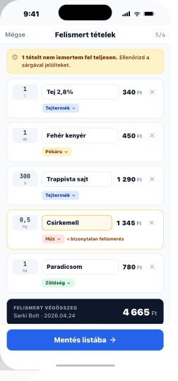
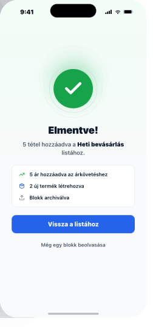

# 10 — OCRFlow (modal · 5 steps)

> **Global modal flow.** Launchable from anywhere; not bound to a tab.
> **Reference:** `screens-05.html` §01

## Why a modal, not a stack push?

The OCR flow is cross-cutting — it can launch from Lista (FAB action sheet), ListDetail (camera icon), or Termékek. Pushing it on a tab stack would force three duplicate routes and break swipe-back. As a root-level modal it dismisses back to whatever was on top.

## The five steps

| # | Screen | One-line |
|---|---|---|
| 1 | `Camera` | Aim & capture (dashed frame, shutter button) |
| 2 | `Preview` | Confirm photo — retake or continue |
| 3 | `Processing` | Server-side OCR runs · no close button |
| 4 | `ReviewItems` | Editable rows · low-confidence amber-flagged |
| 5 | `SaveConfirm` | Green check, side-effect receipt, two CTAs |

## Frame

390 × 844 pt — full screen

---

## Step 1 — Camera

- Black background (uses live camera feed inside)
- Dashed alignment frame **240 × 320 pt** with yellow `#FCD34D` corner ticks
- Helper line: "Helyezd a blokkot a keretbe"
- Big white shutter — **78 pt circle**, centered, 24 pt above bottom safe area
- Gallery affordance (rounded square, 44 pt) left of shutter
- Flash toggle (44 pt) right of shutter
- Status bar tinted dark for contrast
- Close × top-left, 44 × 44 hit target

## Step 2 — Preview

- Full-bleed shot of receipt against black
- Two glass actions top-right: **rotate** (90° CW), **crop**
- Bottom split:
  - Secondary "Újrafotózás" (left)
  - Primary "Tovább →" (right), weighted 1 : 1.4 toward continue

## Step 3 — Processing

- Receipt thumbnail (~280 × 380 pt) centered with horizontal scanner sweep band (1400 ms linear loop)
- Spinner + status copy below
- 3-step micro-progress: `Kép → Szöveg → Tételek` (pip indicator)
- **No close button. Pull-to-dismiss disabled.**

## Step 4 — ReviewItems

- Stack header: back / "Tételek ellenőrzése" / `?` info
- Editable rows: qty + unit, name input, price, trash icon
- Low-confidence rows (conf < 0.78): amber border `#F59E0B`, tag "bizonytalan felismerés"
- Dark total card at bottom of scroll
- Sticky primary CTA under safe area: "Mentés a listába" (or "Új listához mentés" if no list bound)

## Step 5 — SaveConfirm

- Green check icon with concentric rings (300 ms scale-in spring · damping 14)
- "Sikeres mentés" (heading-md)
- 3-line side-effect receipt:
  - "12 tétel hozzáadva a listához"
  - "5 új termék létrehozva"
  - "Blokk archiválva"
- Two CTAs stacked: primary "Vissza a listához", secondary "Új blokk beolvasása"

---

## Pipeline contract

```ts
// Input
interface OCRRequest {
  image: Blob;          // JPEG ≤ 4 MB, client-side perspective-corrected
}

// Output
interface OCRResponse {
  lines: string[];
  items: OCRItem[];
  total: number | null;
  store: string | null;
  date: string | null;  // ISO
  conf: number;         // overall confidence 0..1
}

interface OCRItem {
  name: string;
  qty: number;
  unit: string | null;
  price: number;
  conf: number;         // 0..1 — items < 0.78 surface as low-confidence
}
```

**Confidence threshold:** items below `0.78` are surfaced as low-confidence with the amber state.
**Reconciliation:** items match existing products by `(name, brand)` fuzzy match (Levenshtein ≤ 2); unmatched are queued for new-product creation.

## Entry & exit

| Entry | From | Pre-bound list? |
|---|---|---|
| A | `ListOverview` FAB long-press → "Blokk beolvasása" | No |
| B | `ListDetail` header camera icon | Yes — appends to current list |
| C | `ProductList` long-press FAB → "Barcode beolvasás" | No |

**Exit:** close × at any step **except 3** returns to the previous screen with no side-effects. Pull-to-dismiss > 120 pt closes the flow; locked during Processing.

## Permission & failure

| Case | Behavior |
|---|---|
| No camera permission | Step 1 replaces viewfinder with explainer + "Engedélyezés a Beállításokban" deep-link |
| OCR error | Step 3 swaps spinner for warning icon + "Nem sikerült olvasni a blokkot." Two actions: retry, manual entry |
| Empty result | Step 4 shows receipt thumb + single empty input + "+ Tétel hozzáadása" — user salvages a typed list |
| Save conflict | Duplicate items (same name + price within 24 h) flagged on step 4 with "már megvan" pip; user keeps or skips |

## UX rationale

- **5 steps, not 3.** Preview earns its keep by letting the user retake before OCR cost is paid; explicit Confirm turns "saved" into a memorable moment.
- **Low-confidence styling, not blocking.** Don't block save on confidence — the user corrects faster than OCR reaches certainty.
- **No close button on Processing.** Step 3 takes 1–4 s. Allowing dismissal creates orphan jobs and partial-save state.

## Navigation

- **Route:** `OCRFlow`, registered at root (Stack.Screen `presentation: 'modal'`)
- **Sub-routes:** `Camera`, `Preview`, `Processing`, `ReviewItems`, `SaveConfirm` — internal modal stack
- **Optional params:** `{ listId?: string }` — when bound, items append to that list

## Screenshots

| Step | File |
|---|---|
| 1 Camera |  |
| 2 Preview |  |
| 3 Processing |  |
| 4 ReviewItems |  |
| 5 SaveConfirm |  |
