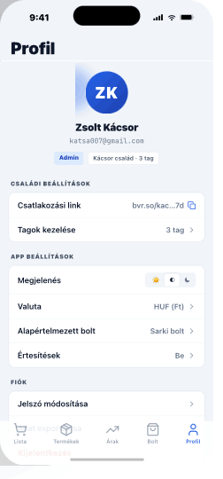

# 11 — Profile

> **Tab 5 (Profil) root.** iOS grouped list. Boring on purpose.
> **Reference:** `screens-05.html` §02

## Frame

390 × 844 pt

## Zones

| Zone | Height |
|---|---|
| Status bar | 59 pt |
| Large title "Profil" | 52 pt |
| Avatar block (80 pt circle + name + email + role chips) | ~210 pt |
| Group · Családi beállítások | ~96 pt |
| Group · App beállítások (4 rows · segmented) | ~190 pt |
| Group · Fiók (3 rows · destructive sign-out) | ~144 pt |
| Group · Rólunk (version + legal) | ~144 pt |
| Tab bar + safe area | 83 pt |

## Why no dashboard?

Profil is the deliberate "boring" tab. iOS grouped list, no charts. A signed-in user comes here to know **who** is in the family, change appearance, and find sign-out. Dashboards live on Árak.

## Groups

### 1. Avatar block
- 80 pt initials avatar (color-seeded by uid)
- Name (`heading-md`)
- Email (`body-sm` muted, mono)
- Role chip (Admin / Tag / Néző) — see `components/Badge.md`

### 2. Családi beállítások
Single row: "Család és tagok" → push `FamilySettings`. Member-count caption beneath.

### 3. App beállítások
4 rows:
- **Megjelenés** — segmented (☀ világos · ◐ rendszer · ☾ sötét). Persisted in `AsyncStorage` under `appearance` + theme provider — applies instantly without transition flash.
- **Valuta** — push to PickerScreen (default `Ft`).
- **Bolt** — push to PickerScreen with search (40+ items). Default is the most-used over the last 30 days, recomputed weekly.
- **Értesítések** — push to `NotificationSettings` (toggles per event: új ár, megosztott lista frissítve, hetiösszegzés).

### 4. Fiók
3 rows:
- **Profil szerkesztése** — push to edit
- **Jelszó módosítása** — push to change-password
- **Kijelentkezés** — destructive action sheet: "Kijelentkezel?" — confirms before clearing the keychain.

### 5. Rólunk
Read-only rows:
- App verzió (`v0.1.0 (build 1)`)
- Adatvédelem (push)
- Felhasználási feltételek (push)
- Nyitott forrású csomagok (push)

## Row anatomy (iOS grouped)

| Element | Spec |
|---|---|
| Container | white card, radius 12 pt, 16 pt gap between groups |
| Row height | 48 pt min, padding 12 V / 16 H |
| Separator | inside group, 1 px `border`, inset 16 pt left |
| Trailing | `ChevronRight` 20 pt muted for push rows; segmented control for in-line settings |

## Component tree

```
<Screen>
  <LargeTitleHeader title="Profil" />

  <ScrollView contentContainerStyle={{ padding: 16, gap: 16 }}>
    <AvatarBlock user={user} />

    <Group>
      <Row label="Család és tagok" caption={`${family.memberCount} tag`} onPress={() => push('FamilySettings')} />
    </Group>

    <Group title="App beállítások">
      <SegmentedRow label="Megjelenés" value={appearance} onChange={setAppearance} options={APPEARANCE_OPTS} />
      <Row label="Valuta" value={currency} onPress={openCurrencyPicker} />
      <Row label="Bolt" value={preferredStore} onPress={openStorePicker} />
      <Row label="Értesítések" onPress={() => push('NotificationSettings')} />
    </Group>

    <Group title="Fiók">
      <Row label="Profil szerkesztése" onPress={() => push('EditProfile')} />
      <Row label="Jelszó módosítása" onPress={() => push('ChangePassword')} />
      <Row label="Kijelentkezés" destructive onPress={confirmSignOut} />
    </Group>

    <Group title="Rólunk">
      <Row label="App verzió" value="v0.1.0" disabled />
      <Row label="Adatvédelem" onPress={() => push('Privacy')} />
      <Row label="Felhasználási feltételek" onPress={() => push('Terms')} />
    </Group>
  </ScrollView>
</Screen>
```

## Navigation

- **Route:** `Profile`
- **Stack:** `ProfilStack` (Tab 5)
- **Push targets:** `FamilySettings`, `NotificationSettings`, `EditProfile`, `ChangePassword`, `Privacy`, `Terms`, `PickerScreen` (generic)

## Screenshot


