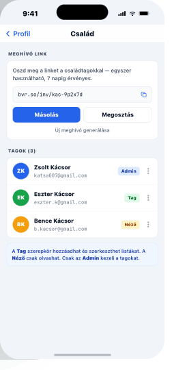

# 12 — FamilySettings

> **Sub-screen of Profil.** Owns invite link + role table.
> **Reference:** `screens-05.html` §02

## Frame

390 × 844 pt

## Zones

| Zone | Height |
|---|---|
| Status bar | 59 pt |
| Stack nav (back · "Család") | 44 pt |
| Family name + edit | ~80 pt |
| Invite card (readonly link · Másolás · Megosztás) | ~150 pt |
| "Tagok (N)" section header | 44 pt |
| Member row | 64 pt × n |
| "Új meghívó" ghost button | 56 pt |

## Invite link

- Readonly mono field — single-use, **7 day TTL**
- Primary "Másolás" + secondary "Megosztás" (`react-native-share`)
- Below: ghost "Új meghívó" — regenerates the link

## Roles

| Role | Badge | Capabilities |
|---|---|---|
| **Admin**  | blue · `#1E40AF` on `#DBEAFE` | Manage members, edit lists |
| **Tag**    | green · `#166534` on `#DCFCE7` | Edit lists |
| **Néző**   | amber · `#92400E` on `#FEF3C7` | Read-only |

We considered Admin / Tag only. **Néző** (read-only) covers grandparents or kids who should see the list but not edit it. Extra picker option, real use case unblocked.

## Member row (64 pt)

| Slot | Spec |
|---|---|
| Avatar | 40 pt initials, color-seeded by uid |
| Middle | name (`body-lg`) + email (`body-sm` muted mono) |
| Right | role Badge + ⋮ menu (change role / remove) |

**Self-row guard:** Admin can't remove themselves while they are the only Admin; the option grays with a tooltip.

## Component tree

```
<Screen>
  <StackHeader title="Család" leading={<BackButton />} />

  <ScrollView contentContainerStyle={{ padding: 16, gap: 16 }}>
    <Card>
      <CardHeader title={family.name} trailing={<IconButton icon={<Pencil />} onPress={renameFamily} />} />
    </Card>

    <Card>
      <CardHeader title="Meghívás" />
      <ReadonlyMonoField value={inviteLink} />
      <View className="flex-row gap-2">
        <Button label="Másolás" variant="primary" size="md" onPress={copyLink} className="flex-1" />
        <Button label="Megosztás" variant="secondary" size="md" onPress={shareLink} className="flex-1" />
      </View>
      <Text className="text-body-sm text-muted">A meghívó 7 napig érvényes.</Text>
      <Button label="Új meghívó" variant="ghost" size="md" onPress={regenerateInvite} />
    </Card>

    <Section title={`Tagok (${members.length})`}>
      {members.map((m) => (
        <MemberRow
          key={m.id}
          member={m}
          isSelf={m.id === me.id}
          canManage={me.role === 'admin'}
          onChangeRole={(role) => changeRole(m.id, role)}
          onRemove={() => removeMember(m.id)}
        />
      ))}
    </Section>
  </ScrollView>
</Screen>
```

## Data shape

```ts
interface Family {
  id: string;
  name: string;
  inviteLink: string;
  inviteExpiresAt: string; // ISO
  members: FamilyMember[];
}

interface FamilyMember {
  id: string;
  name: string;
  email: string;
  role: 'admin' | 'member' | 'viewer';
  joinedAt: string;
}
```

## Navigation

- **Route:** `FamilySettings`
- **Stack:** `ProfilStack`
- **Push targets:** none

## Screenshot


